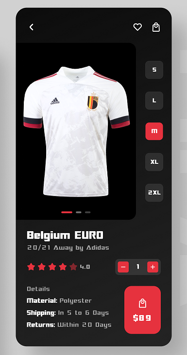

# Week 13 :Practical Break: W02

**Task 01 (Flutter):**

In this task, we will create the following screen in Flutter. For the fonts, please refer for [fonts.google.com](http://fonts.google.com) and search for “Audiowide” font. For the T-Shirt image, you can use this one instead: [T-Shirt Image](https://socceruniformkits.com/wp-content/uploads/2022/03/belgium-home-shirt-2019-21-with-de-bruyne-7-printing_ss4_p-12042321u-ois4j8otb6nm1imu83dcv-0a936cd87a18451aa4cf1844950e5d01.jpg). For the rate bar, you can use the widget in this [package](https://pub.dev/packages/rate) with an initial value of 4 and red colour to show the same shape.

Please, feel free to ask any time about any detail on Discord ( general / get-help ) or our official Facebook page.

---

---

**Task 02 (Dart: OOP):**

**SOLID Principles**

- https://youtube.com/playlist?list=PLwWuxCLlF_uevri_OpofVLXkRRFnZ7TSV
  

One of the most popular systems in real-life applications is E-Commerce or E-Shopping Systems. The E-Commerce means the process of buying and selling online. Amazon, Noon, Ebay, … etc are all examples of E-Commerce apps. An e-commerce app is a very good example to practice on because it contains a lot of entities, properties & functions, and processes. The most basic e-commerce app must have entities like, Category, Product, Order, User, and many other entities. 

In this week, we will work on doing a Simple Dart Command-line E-Commerce App. Please, read many articles and see many videos explaining its idea and may be a couple of videos creating an example of it to better understand and create the E-Commerce System.